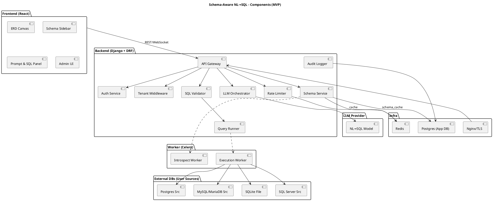
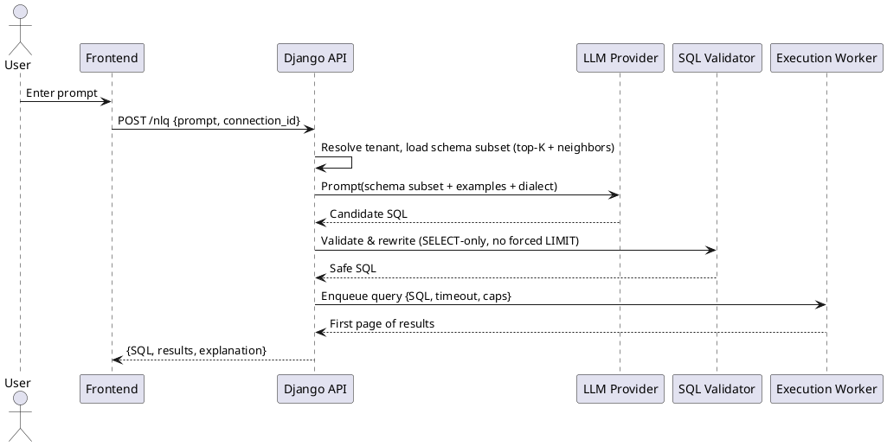

# Architecture Overview

This document provides a detailed overview of the system architecture, key data flows, and design decisions for the Schema-Aware NLQ Query Generator.

## 1. High-Level Architecture & Flows

### 1.1. Architecture at a glance

The system is composed of several key components working in concert:

-   **Frontend (React)**: The user interface, providing the ERD canvas, schema sidebar, prompt/SQL/results panel, and admin UI.
-   **Backend (Django + DRF)**: The core application logic, handling authentication, tenant scoping, schema introspection, NL→SQL orchestration, query validation, and auditing.
-   **Worker (Celery)**: Asynchronous task execution for long-running processes like schema introspection and sandboxed query execution.
-   **Infrastructure**: Essential services including Redis (for caching, queues, and rate limiting) and PostgreSQL (as the application database).
-   **External Services**: User-provided source databases and a pluggable LLM provider for NL→SQL translation.

### 1.2. Component Diagram



### 1.3. Key Flows

#### Schema Introspection & ERD Build

1.  User saves a **Connection** (per tenant). The backend tests connectivity.
2.  The **Schema Service** checks the **Redis** cache. On a cache miss, it enqueues an **Introspect Worker**.
3.  The worker uses **SQLAlchemy Inspector** to reflect the database schema (tables, columns, PK/FKs, indexes, row estimates).
4.  Results are normalized and stored in the application database (`schema_cache`) and a lightweight graph model (`graph_json`) is generated.
5.  The frontend fetches the graph JSON and renders the ERD using **elkjs** for auto-layout.

#### Natural Language Prompt → Safe SQL → Execution

1.  Frontend sends a `POST` request to `/api/v1/nlq` with the user's prompt and the relevant connection ID.
2.  The backend middleware resolves the tenant and loads the relevant schema context (e.g., top-K tables based on prompt content and foreign key relationships).
3.  The **LLM Orchestrator** constructs a detailed prompt for the external model, including the database dialect, safety rules, few-shot examples, and the selected schema context.
4.  The model returns a candidate SQL query.
5.  The **SQL Validator** parses the query using `sqlglot` to ensure it is a `SELECT`-only statement, contains no forbidden keywords, and enforces resource limits.
6.  A **Execution Worker** is enqueued to run the validated query against the source database with strict timeouts and row limits.
7.  The results are streamed back, and metadata (prompt, SQL, status) is logged to the `QueryHistory` and `AuditLog` tables.

### 1.4. Data Model (Application Database)

The core tables in the application's PostgreSQL database are:

```
tenant(id, name, plan, created_at)
user(id, email, password_hash, is_superadmin, created_at)
membership(id, tenant_id, user_id, role)
connection(id, tenant_id, name, driver, host, port, db, user, secret_encrypted)
schema_cache(id, tenant_id, connection_id, payload_json, graph_json, refreshed_at)
prompt_example(id, tenant_id, connection_id, question, sql)
query_history(id, tenant_id, user_id, prompt, generated_sql, status, row_count)
audit_log(id, tenant_id, user_id, action, target_type, target_id)
```

## 2. Algorithms & Tuning

### 2.1. Schema Introspection

-   **Portability**: SQLAlchemy's `Inspector` is used to support multiple SQL dialects.
-   **Performance**: To avoid full table scans, row estimates are fetched from database-specific statistics tables (`pg_class.reltuples` for Postgres, `information_schema.tables.table_rows` for MySQL, etc.).
-   **User Experience**: For large schemas (>200 tables), the schema is fetched and rendered in chunks to provide a responsive UI.

### 2.2. NL→SQL Prompting

-   **Contextualization**: To improve accuracy and reduce prompt size, a schema subset is selected for each query. This is done by:
    1.  Identifying tables and columns that match keywords in the prompt (e.g., using TF-IDF or BM25).
    2.  Selecting the top-K matching tables and expanding the selection to include tables related by foreign keys.
-   **Few-Shot Learning**: Each connection can store 5-10 high-quality question→SQL examples, which are included in the prompt to guide the LLM.

### 2.3. SQL Safety & Execution Sandbox

-   **Validation**: All generated SQL is parsed with `sqlglot`. The abstract syntax tree (AST) is inspected to ensure it is a single `SELECT` statement. A deny-list blocks DDL, DML, and dangerous functions.
-   **Resource Limits**: We do **not** inject `LIMIT` clauses by default. Instead, safety is enforced by the execution worker, which applies server-side **result size caps** (e.g., 100 MB or 1,000,000 rows) and **timeouts** (e.g., 30 seconds).
-   **Timeout Enforcement**: Timeouts are enforced using dialect-specific commands (`SET LOCAL statement_timeout` for Postgres, `SET max_execution_time` for MySQL, etc.) and backed by Celery worker timeouts.

### 2.4. NL→SQL Flow (Sequence Diagram)


